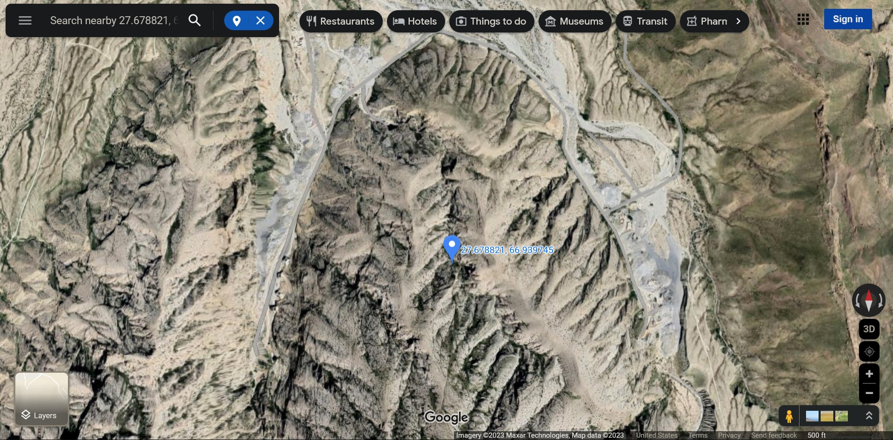
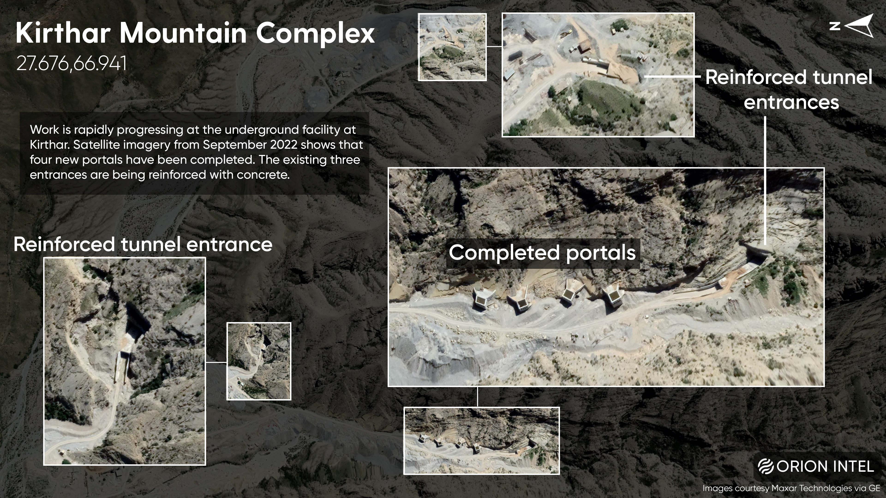
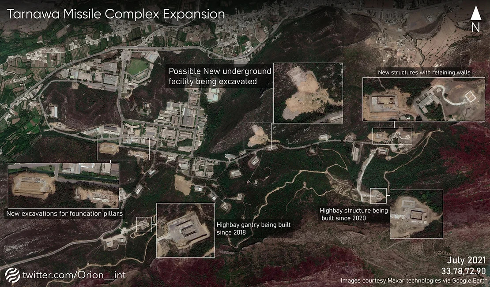
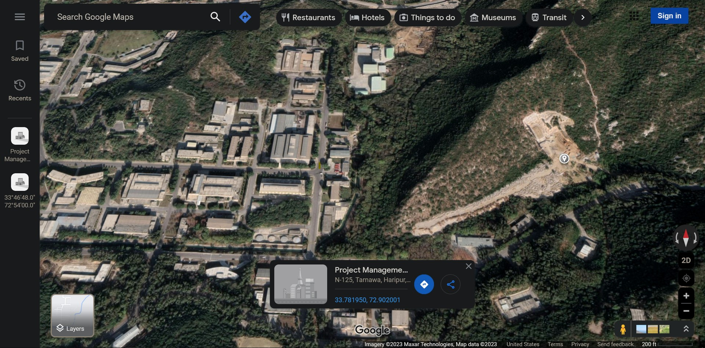

## Mountain Strongholds

For some reason this set of data caught my attention. Though I would like to have ignored it, to continue with my main set of activities in writing about the debt owed by Canadian entities to persons like myself, I am going to consider this a side topic for now. I'll try not to stay distracted with this and digress too much from the usual flavor of mixed-media artwork I've been producing. 

### (A) 27_680N-66_939E

The following images show a mountainous region to the South of the city of Khori, Khuzdar District, Baluchistan, Pakistan. 

<br>
<div align="center">
  </img>
  <br>
  <b>Image A1</b>
  <br>Source: Maxar Technologies, Map Data via Google Maps
</div>
<br>

Nothing particularly interesting about this region, it is a fairly ordinary site with some construction work surrounding the given global positioning coordinate of 27.680 North, 66.939 East. This coordinate is referred to as **Location A** in this report. 

However, if you were to suddenly catch wind of some data visualization like the one done by a freelancer called Orion Intelligence (Twitter [@orion__int](https://twitter.com/orion__int)), you would be able to appreciate few more details.  

<br>
<div align="center">
  </img>
  <br>
  <b>Image A2</b>
  <br>Source: Maxar Technologies, via Google Maps, arranged by orion__int
</div>
<br>

With reference to *Image A2,* it might be speculated that a missile storage facility is being constructed at **Location A,** with a number of tunnel entrances on each of the mountain's accessible sides. The location also has, what Orion Intelligence has labeled as "Completed Portals", on the North-West side of the mountain. 

I do not know what the word "Portals" is supposed to mean, but they do look like guard towers with Heating Ventilation and Air Conditioning (HVAC) systems for the subterranean building complex. 

What might the construction site actually store? Is it likely that it will be used for storing armaments? 

1. **Location A** is more than 10 hours away from Gwadar seaport by ground transportation vehicles. Likewise, it is around 5 hours by land from the city of Karachi, and approximately 3.5 hours away from the city of Larkana. 

1. There haven't been any interesting missile production and stationary launch sites within the triangulated region mentioned-above. So, if **Location A** were to be used for storing missiles and various types of warheads, those types of armaments would need to be transported from the nearest production factories, or cargo off-load ports.  

1. Missiles are most vulnerable to being attacked by air-to-surface units, or getting sabotaged by localized entities, while they are in transit onboard cargo vessels or launchers. Additionally, the region around **Location A** does not appear to be suitable for going off-road with mobile launchers for short, medium, or long-ranged missiles. 

1. So, why not build the entire missile production facility inside the mountain? That could allow mobile platforms to launch missiles when needed, by sneaking out from inside the mountain, and then retreating into the strong-hold for reloading while using cover from being targeted. Awesome idea, and they just might be able to do it. 

1. A much more innocuous and benign set of mining operations being carried at the site, could also be a reason for making use of advanced, reinforced structures at tunnel entrances. Mining for what, though? Mining anything as simple as granite for supplying concrete to construction industry. Why not? The excavated material dumped next to the access roads can be analyzed with image processing software, to estimate the volume of earth cored out from inside the mountain. It is undoubtedly an expensive and large excavation project. And the dirt that has been dug out from the area, is still sitting there. 

1. It is also possible that, the current Pakistani military and political chiefs have accepted a deal to store spent fuel from foreign nuclear energy production industries. 

    1. When a city-state or a nation-state goes bankrupt, and becomes desperate for cash, especially for foreign exchange currencies, it typically resorts to building large casinos, prisons, and landfills as a means to acquire the much needed cash from foreign countries. 

    1. Casinos in Pakistan possibly cannot be a 'fabulous' foreign tourist attraction like the ones in Macau, China, or Las Vegas, USA. A casino inside a mountain would be a very hardcore, underground business, plus a very well shaded one, especially if it were constructed and operated illegally. However, it would be simply "haram" to legalize gambling for building large casinos that would also need to sell "firangi paani" to attract customers.  

    1. Renting land and constructed facilities as penal colonies, concentration camps, detention centers, and jails for punishing ruffians and hoodlums of imperialists, in a region where human rights isn't a popular concept, is a traditional big business. For example: America's use of Guantanamo Bay as an ultra-max security prison and concentration camp, as well as Australia's use of Nauru as a 'processing center.' Soon enough, a location within Rwanda, or in some other African country is going to be a super-massive 'processing center', for Britain's asylum seekers. Quaint huh? But, shoving people into a huge mountainous prison with expensive HVAC would be uneconomic, even for the *brutalists* of Britain and America.

    1. The most lucrative landfill one can build is for spent nuclear fuel rods. A country such as France, would easily pay enormous sums of money to have their used nuclear fuel pallets stashed anywhere, as far away from Europe as possible. Such landfills would even pay long-term dividends, even if new spent fuel weren't being stored in them, as long as international agencies concerned with nuclear energy were to be allowed, to inspect and verify the integrity of those storage sites, on a regular basis. Clients would be contractually obligated to continue to pay for maintenance and upkeep, for each year the stored materials were to remain intact and safe, without any form of tampering done to the storage units, as per international norms and standards. Sweet! Nations of the planet ought to help Pakistan build this for promoting safe nuclear energy production, with all the bells-and-whistles needed for keeping it safely operational, instead of somehow encouraging Pakistani heads of state to build storage sites for biochemical and radiological warheads, along with various kinds of missiles and launch vehicles. But, it is simply more likely that **Location A** is going to be used for military armaments. Sad isn't it?

Speaking of existing and expanding Pakistani missile silos, with Inter-Continental Ballistic Missile (ICBM) launch capabilities, let us view the next set of images concerning **Location B.**

### (B) 33_781N-72_902E

The coordinates 33.781 North by 72.902 East, is referred to as **Location B** in this article.

*Images B1 and B2* showcase the progress of construction projects, at the missile production, and propulsion testing facilities in Tarnawa, Haripur, Pakistan. It is a scenic location, to the South of the Khanpur Dam, on river Haro.

<br>
<div align="center">
  </img>
  <br>
  <b>Image B1</b>
  <br>Source: Maxar Technologies, via Google Maps, arranged by orion__int
</div>
<br>

<br>
<div align="center">
  </img>
  <br>
  <b>Image B2</b>
  <br>Source: Maxar Technologies, Map Data via Google Maps
</div>
<br>

It appears that construction crews have cut into the side of a mountain at **Locaton B,** to build a generic launching or storage area for missiles. Indeed, the Pakistani military has geared up into war-time industrial production. 

Now, who are the Pakistanis about to go to war with? Try and guess, who could it possibly be? 

Yes, you guessed it right! They are about to wage a war with themselves, in exactly the same way politically enthusiastic generals in Sudan, are currently embroiled in a civil war. Even if the Pakistani military were to wage a war against India, or any other neighboring country, at any point of time in the future, it would be tantamount to launching missiles upon themselves and poor Pakistani civilians. 

So, did investing in production pipelines and operating units for warheads, and ICBMs, help alleviate the burdens of downtrodden Pakistani people, from natural disasters like pandemics, floods, and droughts? No.

Is anybody from any other country, interested in attacking Pakistan with an occupational force, to become Pakistan's new government? No. 

Number of days since the end of violent attacks, against a minister of the Pakistani parliament or a judiciary officer, by members of local sectarian groups? Zero. 

---

```
Acronyms:
HVAC - Heating Ventilation and Air Conditioning
ICBM - Inter-Continental Ballistic Missile
USA  - United States of America
```

---

#### Disclaimer
The images and content used here belong to respective copyright holders, as and where indicated. They have been reproduced for non-commercial, educational purposes. 