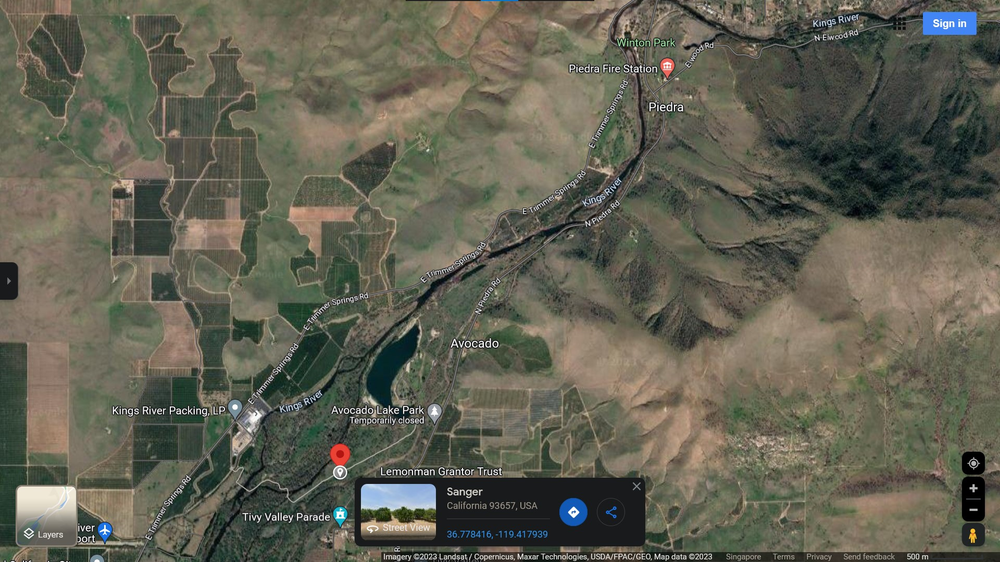
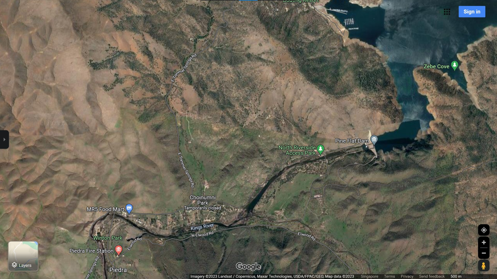

## Wildfires, Water Crises, and Carbon Credits 

In this article let us explore a somewhat randomly selected, semi-arid region of North America, to discuss inter-related topics of wildfires, water crises, and Carbon Credits.

*Image 1* shows an area that is approximately 40 kilometers (25 miles) East of Fresno City, in [Fresno County, California, USA](https://en.wikipedia.org/wiki/Fresno_County,_California), where agricultural and packaging industries are the major employers of local town-folk. 

Is there anything special or interesting at this place? It seems to be an ordinary rural area on the outskirts of Fresno City's suburbs, there really doesn't seem to be anything interesting situated over here, except for the usual orchards and a river called the King River. 

<br>
<div align="center">
  </img>
  <br>
  <b>Image 1</b>
  <br>Source: Maxar Technologies, Map Data via Google Maps
</div>
<br>

It can be observed that almost all recreational parks near wildlife areas within such counties of California, have been temporarily closed to the public by the US Department of Natural Resources, Forestry Division, at this time of the year. People aren't supposed to attend barbecue parties in those parks because this is the wildfire season of the year. One would have thought that seasons were meant to be labeled as spring, summer, fall, and winter in North America, but we now have sporadic seasons like stormy, fiery, deathly, and not-calamitous. Not-calamitous is the best season which occurs at arbitrary times of the year, each time lasting for an unpredictable duration of few weeks to a couple of months. 

It can also be observed through satellite images that, the likelihood of wildfires occurring and propagating in a location where the ground moisture levels are significantly high due to a river's shallow embankments, is relatively lower, compared to the mountain ridges to the East of the Piedra Fire Station, where surroundings with dry shrubbery and parched trees can end up becoming fuel for a forest fire. 

Forest fires in such regions are more likely to get ignited during existing climatic conditions due to natural reasons like lightning, or due to human activities. Reasons for wildfire ignition can even include discarded glass bottles laying on the ground, that can turn into a refracting lens under peculiar weather conditions, which can then focus a beam of sunlight onto dry tinder to ignite it. A propagating wildfire usually chars and destroys artifacts like glass bottles or shards, leaving behind no evidence of how the fire started. Plus, how would any investigators identify small pieces of trash like a glass bottle, within an area of thousands of hectares, in the aftermath of a wildfire? This is why a large portion of the investigated causes for a wildfire are often unidentified, or unidentifiable. 

So, if a forest fire were to occur in this region, would the local fire station have adequate resources to manage and put out the fires? Most probably it would. When we look at the [Piedra Fire Station's website](https://www.fresnocountyfire.org/our-department) we get to learn about the regularized and well-maintained operations of the commendable local fire department. The transparency adopted within the station's management indicates that it is able to receive required funding, equipment, vehicles, and preparatory materials for training, after a few years of repeatedly requesting them from the district. That is considerably better than being completely underfunded, and not having the department's requirements fulfilled for decades. A county like Fresno in California, should have sufficiently sustainable industrial and economic activities to be able to support all the needs of its early responders like firefighters via state and federal taxes, right? 

Ah wait, that's it, that's the problem: *"sufficiently sustainable!"* How does one sustain super massive agricultural businesses practicing mono-culture crop plantations, during [El Niño](https://en.wikipedia.org/wiki/El_Ni%C3%B1o) related drought conditions with water scarcity, and increasing numbers of sudden wildfires? 

It appears that the odds have started to stack up against agro-businesses in such regions of California, because of planetary natural phenomena like climate change. So, would arson by local assailants keep increasing those odds against profitability of agro-businesses in the region? 

Well, first of all, why are there any types of assailants trying to set fires to forests in such regions of the world? I have no idea. But they seem to simply exist, and are usually middle-aged or elderly men living in poorer economic conditions, such as these ones: https://abc30.com/tag/arson/    

Now, how badly can homeowners and business owners be impacted by brush fires and forest fires? What is the worst that could possibly happen to the lives and equities of those people? Um, usually it is deaths, profound devastation and bankruptcies, with inability to recover any equity from the scorched area for years; especially because insurance companies don't exactly help quickly, nor to any significant extent in cases involving wildfires ignited by arsonists. 

You see, the weakest link in North America's security systems happens to be private insurance companies because they are the greediest link in every North American industry supply chain. The greediest link, *is* the weakest link. 

However, private insurers do have to wait, sometimes for years, until investigations of how and why an arsonist chose a particular area to set fire to, are completed, in order to avoid insurance fraud and false insurance claims. Such a waiting period can be seriously prolonged, particularly when it cannot be unambiguously determined that the arsonist wasn't colluding with the insurance claimants. And if it can be ascertained that the arson was an act of terrorism, then the insurance company can invoke typical clauses within boiler-plated contracts, which completely absolve the insurer and underwriter from paying out anything what-so-ever, to the claimants. Total loss! Complete setback! No recovery! Massive cascade of shocks! 

But the main topic of this article isn't about arson, it is about the impact of dams and levees breaking because of natural, or human engineered reasons, causing major flooding to towns and cities. Right, that might not have seemed all too obvious from the title of this document, but let's just segue to a discussion about problems that lead to water crises. 

You see, severe water crises aren't about immediate or short-term scarcity of water for residential, commercial, and industrial sectors, which can otherwise be managed through infrastructure projects and policy changes via city ordinances. Severe water crises are about such drastically long-term scarcity and irrecoverable damages, that cities become completely desolate and turn into ghost towns, like those in Louisiana after hurricane Katrina, where even the federal government becomes hapless and helpless due to the catastrophe. 

Flooding is the most difficult issue faced by North American insurance companies, because it is rather frequent, and resulting damages can be too widespread. Insurers balk at the idea of creating a fund to protect clients from floods, mostly because the number of separate claims from individual clients can be too large for the company to handle within a meaningful duration of time. It is not the size of claims that frightens insurers, it is the hassle of having to suddenly deal with many claims for which they do not have, and will never bother to hire, sufficiently many salaried or wage earning human resources.  

An underwriter or an insurance company can almost always find an excuse to cap the maximum amount of a claim that can be paid out to a claimant, but putting a limit on the number of individual claims that might arise after a calamity is not within the managerial strengths of insurance company owners, and investors. This is why, North American insurers that are currently inundated by claims related to forest fires, identity thefts, cyber-crimes, long-covid healthcare costs, and accidental deaths due to sudden collapse of ailing buildings, are shying away from even providing insurance quotations to new customers residing in fire prone regions of states like California, and in flood prone regions of ones like Louisiana. 

People residing in the US who need insurance coverage from flooding related damages can purchase supplementary policies with higher premiums from private insurers. They can also apply for the federal flood protection program for insurance coverage, even though that particular US Treasury federal account has been overdrawn by hundreds of billions of dollars, and is currently holding a very sizable debt. But incurring large debts due to overspending and fiscal incompetence, obviously does not matter to the US government because it can simply add that debt as a positive value in the calculation of America's Gross Domestic Product (GDP), in order to show an increase in the nation's GDP. 

If you are wondering how and why the US government can do that, the answer is, it simply can. Debts and arrears generated by flooding damages, as well as ever increasing budget deficits of federal departments like the Forestry Department, can be thought of as a credit or a loan, issued by America's denizens to the US government, with the assumption that the US government will make good on repaying those debts with interest, and will resolve its budget deficits, in the future.  

How far in that future? The calculation about the time period, with assumptions about the likelihood of America's physical ability to genuinely pay up on its debts, via the earnest labor of its residents in producing export worthy goods and services, is what goes into the valuation of US Treasury bonds of short-term and long-term yields. As you can see, the US government has found quaint ways to give a positive spin to long-standing, uncollateralized, national bad debt, by letting international markets eat the losses from owning depreciating US treasury bonds. The collapse of Silicon Valley Bank and First Republic Bank were only moderately sized financial levees that collapsed in the recent months, because of mismanaged, fractured banks and banking systems. 

So, let us look at *Image 2,* in which we can see a moderately sized dam called the Pine Flat dam (moderately sized compared to the [St. Francis Dam](https://youtu.be/ocju4Y23j0M)), that could potentially cause an unexpected flood in an arid region of California, due to a sudden breach. 

<br>
<div align="center">
  </img>
  <br>
  <b>Image 2</b>
  <br>Source: Maxar Technologies, Map Data via Google Maps
</div>
<br>

What would happen if the Pine Flat dam were to fail and collapse? But wait, why would it ever fail or collapse? Its construction is undoubtedly sound, isn't it? Regular inspections of the dam's health and functionality are being conducted, aren't they? The irrigation systems and canals aren't mismanaged or fractured in any way, are they? There also have been no shortages in funds, equipment, or human resources to inspect and repair such dams for maintenance, right? 

And if a sudden issue were to arise at the Pine Flat dam, the first responders from the Piedro Fire Station would surely be able to handle it. Surely. They certainly have sufficient human resources and training to deal with... 

Hmm, would the Pine Flat lake reservoir emptying out into the King River valley wash away the fire station? 

So, there is no way that such a dam can be allowed to fail or have any type of a mishap. The aftermath of even such a moderate sized dam failing, would be too tragic for the local population in Fresno County. And the eventual effect of the Pine Flat lake emptying out into the King River valley, on water shortage issues in California, would become much worse in the months and years following the dam's failure. 

By the way, what would be the likelihood that sappers or saboteurs would attack such dams, to cause them to fail in a catastrophic way? Surely, such public infrastructure projects will remain safe as NATO gets more deeply embroiled in a war with Russia, while the US is preparing to go past full-tilt on China, over the issue of Taiwan being an independent country. Surely and certainly, North American infrastructure projects *will* remain operational and safe, no? 

In any case, how many dams, bridges, utility supply lines, roadways, railways, power stations, seaports, and airports are in a state of disrepair, and could cost millions, if not billions of dollars in losses, if they were to fail? Too many to count and keep track of!? 

And if any critical infrastructure were to fail, how difficult would it be to investigate and confirm that the failure wasn't due to some kind of a sabotage? Too difficult to estimate!? 

At least there isn't anything else like citrus tree infecting pestilence, or soil erosion from deforestation, due to commercial and industrial activities that can add to a natural disaster, is there? Oh, there is? 

Can't people simply keep cutting down forests and reducing bio-diversity in places like North America and Europe, for accelerating their economic growth by exchanging [Carbon Credits](https://en.wikipedia.org/wiki/Carbon_offsets_and_credits) with countries from Central and South America, Africa, Asia, and the Indo-Pacific to avert climate change?  

>Producing greater volumes of pollution at an increasing rate from industrial activities, in one part of the world, and then pretending that the increased ecological degradation within that localized region is somehow going to be offset, by not polluting as much, in another part of the planet, is the same as saying that corporations can continue to gouge the rivers, lakes, and aquifers in and around California, to achieve environmental sustainability in California, simply because human settlements are barely utilizing water resources in and around Mongolia. 

And that is basically what Carbon Credits are. Unfortunately the concept of Carbon Credits has remained a nonsensical farce, even though it was somehow supposed to magically reduce the overall magnitude of greenhouse gases being dumped into the Earth's atmosphere, at a global scale, in order to reduce the financial impacts of climate change being felt by industrialized nations. The miracle silver bullet called Carbon Credits hasn't achieved any verifiable reduction in the rate at which the global ocean levels are rising. And rising sea levels along with disappearing ice caps will undoubtedly cause worsening floods in coastal areas. As such, the trade of Carbon Credits hasn't counteracted the most challenging aspects of climate change, in the least bit. 

However, what is so bad if climate change continues to get worse? How can it possibly impact people living in sequestered and insulated places like Washington D.C.?

To answer the above question in a language which can make sense to White House officials, we can note that, the national security risks posed to industrialized countries due to climate change, have been steadily increasing. It turns out that climate change can also be used as a cover for sabotage involving wild fires, and floods, but at least not for earthquakes, tsunamis, and sink holes. 

Come to think of it, there certainly isn't a way to engineer an earthquake or a tsunami as a clandestine act of war, is there? How about with subsurface thermonuclear weapons near a geological fault line? Or, how about a large array of big solenoids or linear actuators, that can be synchronized for generating increasingly large amplitudes of mechanical vibrations through constructive interface, to remotely damage bridges, and dams in subtle but effective ways? 

Can sink holes be created at strategic locations, by damaging pipelines for crude oil, natural gas, water, or sewage at those locations, using small unmanned vehicles with bombs, being driven into those pipelines? 

It's not like a number of DARPA projects were exploring such science-fiction like ideas over the past decades, by spending billions of dollars worth of tax-payer money, on developing those kinds of projects against other countries, right? Oh, they were? They still are? Have any succeeded? Practically none? Except for one or two that became highly classified? 

One has to genuinely wonder, whether human beings are ever going to stop destroying the only planet that can support life in this solar system? Will people stop pretending that Earth's moon and the planet Mars can be colonized within the coming decades, when we can't even figure out how to create a sustainable city in places like California that <ins>used to be</ins> enormously rich in ecological resources? 

---

```
Abbreviations:

DARPA - Defense Advanced Research Projects Agency 
GDP   - Gross Domestic Product 
NATO  - North Atlantic Treaty Organization 
US    - United States (of America)

```

---

### References:

Map images - https://www.google.com/maps/place/36%C2%B046'41.7%22N+119%C2%B025'04.6%22W/

---

### Disclaimer
The images and content used here belong to respective copyright holders, as and where indicated. They have been reproduced for non-commercial, educational purposes. 