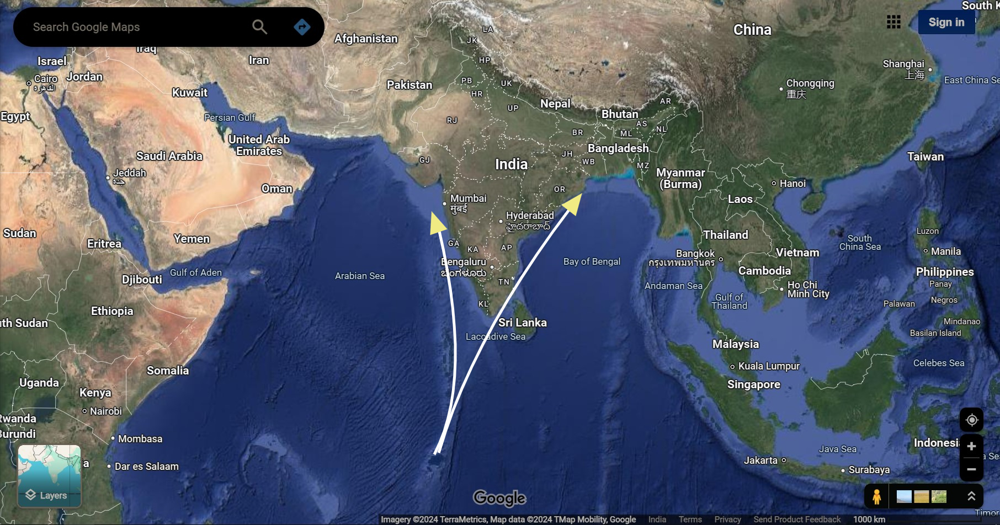

## American Nuclear Option Against South Asia  

>Aside from ignorance, cowardice is one of the worst diseases that can afflict a soul.  

In this article, let's discuss the American nuclear arsenal stashed in Diego Garcia, in British Indian Ocean Territory.  

Other than the American Inter-Continental Ballistic Missiles (ICBMs) that can be launched via platforms on land and in the ocean, there are the aerial platforms capable of launching missiles with a variety of strategic and tactical nuclear warheads which, are much more difficult to detect and hit, once they are airborne. Of the nearly two dozen units of [B2 Stealth Bombers](https://en.wikipedia.org/wiki/Northrop_B-2_Spirit#Further_developments) that are constantly equipped and ready to strike at a target anywhere in the world, at an instant's notice, at least two are regularly stationed at Diego Garcia, "for America's global safety and security program."[^1]  

If South Asia, i.e. India, were to ever oppose America in an actual World War, the likely scenario involving American nuclear Weapons of Mass Destruct (WMD) being launched at the Indian Subcontinent would include:

- One of the B2 Bombers flying towards Mumbai and another one flying towards Kolkata from Diego Garcia. 

- Within a total of half an hour, or an hour of a bombing raid: 

	- The westerly "Spirit" would bomb everything along west-coast of India, and the easterly one, obviously, would take out cities along India's eastern-coast. 
	
	- Cities like Bangaluru, Chandigarh, and Delhi NCR would be nuked by either one of those aerial platforms, and all of the metro cities like Mumbai, Hyderabad, and Kolkata would be reduced to a crater. 

	- The nuclear fallout would blanket the entire Asian Subcontinent, tens of millions would die instantly, and hundreds of millions of souls would perish in the subsequent months and years. 
	
- Within 6 hours of a total flight time, in a single sortie, the westerly headed bomber would eventually land somewhere in the Middle-East, at one of the airbases in either UAE, Bahrain, Qatar, Kuwait, Saudi Arabia, or Turkey. And the other bomber would most probably land in Singapore. Both of them would refuel, and then return to Diego Garcia. The leaders in America and the pilots in those airplanes wouldn't feel a single pinch in their heart or their soul. 

</img>   
Background image via Google Maps | Imagery, MapData, TMap Mobility, Google   

That type of a full-scale nuclear war in South Asia would also end up killing and debilitating millions of people along the coast of Africa, Middle-East, and South-East Asia, merely because of the radioactive particles wafted by trade winds and ocean currents around the globe. 

Of course, after that, everything in North America would burn because of Indians and other Asians currently residing in the Americas. Not a single American man, woman, or child would be left alive anywhere on the planet. 

So, leadership in India can simply tell AUKUS to "cool it", because their nuclear threat is useless. There is no reason why any country should ever be afraid of NATO or USA, or ever become beholden to American military might, unless they are the Philippines. 

However, the USA and its Western Allies have never needed anything more than withholding of some favors and privileges from Indian diplomats and bureaucrats, to steer those "poor and lowly Indians" via soft-power to show them who is boss. Eventually some scraps and hand-me-downs are given to India to maintain the *Bamboo Wall* around China, so as to appease some of the "rowdy and unruly Indians." Material and moral support given to India from the West, is similar to the type of support being given to Ukraine via "drip irrigation" to maintain the *Iron Wall* around Russia. All that is indeed changing these days, because people labeled as Guinea (Negroes) and Savages (Indians), have started to realize that The Creator of The Universe gave each living creature the permission to breathe, and coincidentally, also gave creatures such as human beings the right to dignity with freedom from the yolk of colonialism. 

>Do ask yourself, "Who gave me the permission to breathe and by which authority?" Was it a king or a queen of England? Or a president or a prime minister of some country? Was it some type of a patriarch or a matriarch that gave me the permission to exist? 

There is a genuine reason why many Americans and Europeans think of Allah as the ultimate terrorist, because Allah has nothing to gain or lose from human endeavors. There is simply no way to negotiate with a Being that has absolutely nothing to gain or lose, just the same way there is no way to negotiate with "terrorists." Jesus and Krishna, by the way, aren't comparable to Allah, neither via similarity, nor via contrast, the same way each thing in the universe along with its entirety, are not comparable to Allah, in any shape or form. And that, of course, is very upsetting for those people, including many Muslims, who need the escapism of religiosity to cox and cajole "God" (or themselves), with some way to appease a deity, and to then become blessed with the ability to overcome "the uncertainties of life." There are also many people who think of God as a Being that is "Omnipotent" and "Omniscient", and also as a Being, Who will somehow respond to humans as a micromanager of the world. Those people have yet to contemplate "The Omnifortunate Being." It is simply impossible to bribe or threaten a Being that has genuinely nothing to loose or gain, from any and every eventuality. This is why Sunni Muslims don't offer or take bribes, because those types of under-the-table activities for effecting "the future", are truly worthless and fruitless in the long-run. 

Plus, if Russian [S-400 Surface to Air Missile (SAM) systems](https://en.wikipedia.org/wiki/S-400_missile_system) with 96L6 High-Altitude Radar Units linked with satellites were to be deployed in Ladakh region of India because of forthright business deals, everything in Earth's atmosphere till the southern tip of Madagascar could become visible to the Indian military, all the way from Northern India. Also, a number of places in Ladakh could be very useful for building observatories for astronomy, because of that region's naturally clear and dark skies. 

And yes, the Turkish Military Research and Development (R&D) groups are tuning their [Kaan](https://en.wikipedia.org/wiki/TAI_TF_Kaan) aircraft to become less susceptible to Russian S-400 systems. They didn't simply buy those Russian SAM systems for detecting Israel's modified versions of older F-16, F-18, and newer F-22 and F-35 airplanes. 

However more importantly, once the reintegration of Taiwan into Chinese Territory begins with full-steam, so as to impact India's influence in the Indo-Pacific region, the Chinese cyber-warfare units will most probably slash or completely block all monies and favors, getting routed to right-wing organizations in India from AUKUS. AUKUS will most probably keep trying to pump more money into those right-wing groups in India to acquire underwater mining rights in the Indian Ocean, especially if Donald Trump gets re-elected as US President. But it is much more likely that by the end of November-2024, Indian owned or controlled corporations throughout the world will pump a whole lot more money into American left-wing groups than anybody can possibly imagine, to boost the chances of Kamala Harris becoming the first female President of the USA. 

In any case, between December-2024 and February-2025, the world might get stuck in a guessing game, about the results and outcome of the US Presidential Elections. And Trump along with his supporters will certainly not concede a defeat, peacefully, if those results favor Harris. 

In the mean time, the scores of Chinese submarines which have surrounded regions like the British Indian Ocean Territory, will target anything and everything that takes off or lands in Diego Garcia, in order to assert Chinese mercantile and military dominance over straights of Malacca, now that heavy marching orders to cordon Taiwan are being implemented by the People's Liberation Army. 

Chinese Polit Bureau's logic is simple: if the USA can assert control over the entire Pacific Ocean using its military, then why can't China control the whole of South China Sea along the "Nine-Dash Lines", especially when the Chinese can afford to spend a defense budget of Three Trillion Euros more than that of the Americans? 

Basically, if the Chinese gain full control of Taiwan, and break free of the barricade formed by the chain of islands in the Pacific from Japan to the Philippines, then the Chinese Communist Party might relax their interests in the South China Sea, by instead foraging further out into the Pacific Ocean towards Australia, for gaining mineral and oceanic riches.[^2]   

[^1]: And for lulz!  

[^2]: And also for lulz!  