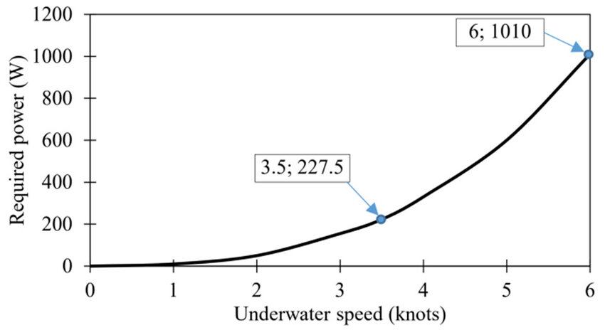

## Stealthier Propulsion Systems for Naval Vessels

Air Independent Propulsion (AIP) systems for a 3000 metric tonne submarine, needs to generate around 1000 kilo Watts (kW) of power to push the vessel at 6 knots, 2000 kW for 12 knots, and 3500 kW for 20 knots of submerged speed in open sea. At those speeds, the submarine wouldn't be able to chase a destroyer, as modern destroyers including those owned by Pakistan can comfortably achieve speeds around 22 knots. 

 

</img>

<strong>Submerged Speed vs Propulsion Power for Submarines  Src: <a href="https://www.researchgate.net/publication/380881158_Design_and_Simulation_of_a_Fuel_Cell-based_Hybrid_Underwater_Vehicle_Propulsion_System_in_MatlabSimulink">Nguyen Huy Chien et al. (2024)</a></strong>

  

Typically, submarines operating at 6 knots of average submerged speed can traverse thousands of nautical miles during a mission spanning weeks (200 to 300 hours) or months (700+ hours). So, manned as well as unmanned submarines with only an AIP system, are better suited for patrolling and loitering to defend key regions of the sea that have valuable ingress and egress routes for mercantile or military activities, rather than for chasing a target or for quickly maneuvering into greater oceanic depths to escape from anti-submarine air crafts and naval vessels.  

### Comparison with Land Vehicles 

Comparatively, various modern air breathing, diesel locomotive engines such as the [GE Dash-9 Series,](https://en.wikipedia.org/wiki/GE_Dash_9_Series) manufactured in the USA, can generate approximately 0.75 kW per Horse Power (HP) rating of the engine. So a 4000 HP (3000 kW) diesel locomotive can potentially haul 8000 metric tonnes of freight at 50 km per hour, or at 27 knots, on flat railway tracks. Those types of diesel engines for trains typically weigh-in at 900 tonnes and have a size of 21.5 m length, 4.7 m height, and 3.1 m width. 

The size of AIP systems in submarines with their oxidizer tanks for hydrogen fuel-cells or for sterling engines, are much lighter and smaller than, and practically vibration free, compared to diesel locomotive engines. Even in comparison to diesel-electric submarine engines, AIP systems are more manageable and cost effective for long-range and long-duration missions (500+ hours). 

### The Near Future for Oceanic Vehicles

So, fitting an existing submarine by chopping its cross-section and then extending its overall length with a new section for AIP, would modernize the submarine. Trying to add an AIP system into an existing submarine, without modifying the submarine's hull length, would require its conventional main engine to be replaced with a smaller and more streamlined diesel-electric propulsion system. 

However, all such modifications to existing submarines, or for the construction of new ones involving lithium-ion batteries and AIP systems, is merely a stop gap technology solution on the road to modular nuclear engines. Though eventually, all nuclear submarines and aircraft carriers will also need to be equipped with auxiliary AIP systems. AIP systems with electric fuel-cells powered by hydrogen and oxygen extracted directly from electrolysis of sea water, using onboard nuclear power plants, would most probably produce the quietest submarines with greatest endurance, attack, and stealth capabilities. 

 

</img>

<strong>Hypothetical power and speed profile for mission stage  Src: <a href="https://swzmaritime.nl/news/2024/08/01/submarine-power-plants-potential-of-new-configurations/"> Mariska Buitendijk (2024)</a></strong>

  

### The Larger Picture

In my humble opinion, the greatest hurdle towards the development and adoption of safe and cost-effective nuclear propulsion and power systems for naval vessels, is the lack of education and knowledge among systems developers and policy makers about nuclear technologies. The clarity and foresight needed in the visions formulated by heads-of-state and their advisors, cannot become better, through any amount of data sheets and tech-demos presented to them. Their vision is hampered and murky due to fears of the unknown coupled with nightmarish stories filled in their heads about the acquisition of enriched nuclear fuels and the storage of spent nuclear fuels.   

A severe hurdle, in the improvement of global transportation security, is the woeful culture propagated by numerous British naval chiefs who keep ginning up the story of how nuclear technology is more expensive and complicated, than existing air breathing engines that use gaseous or liquid oxidizers for hydrocarbon or hydrogen fuels[^1]. Those British military chiefs of course have the advantage of using the US Navy for developing and operating nuclear technology based propulsion systems for naval vessels, on their behalf via NATO. 

A country like India on the other hand, that has bought into the silly story about nuclear technology being too complicated and expensive, does not have the advantage of using the Russian or Chinese industrial-military establishments for building and operating nuclear technology based electrification, propulsion, and weapons systems on behalf of its republic, though the Indian government could certainly do that through a change in its existing geo-political stance and policies.  

>Adoption of nuclear power plants for electrification of cities and logistics networks, is similarly hampered by people stuck in the dumb-days of petrochemical and coal based technologies. 

The most important thing to note here is: the emergence of the electric light-bulb was not an incremental improvement of the candle flame, nor has the advent of quantum computing merely been a step-wise improvement of transistor based computer chips. As such, the countries that succeed in accepting and adopting the necessary paradigm shifts in the way things are thought about and worked upon, manage to withstand cultural genocides to sustain their values and standards of living, while the rest succumb to eradication due to obsolescence. Not only technologies, but even linguistic precepts and religious theologies become obsolete and discarded, because of which, only the most modern and useful ones survive alongside axiomatic ones.   

 

### References 

1. Lt. R. H. Goodenough, and Alistair Greig, "Hybrid nuclear/fuel-cell submarine", *Journal of Naval Engineering 44(3),* 2008. https://www.researchgate.net/publication/237308846_Hybrid_nuclearfuel-cell_submarine  

1. Raajiv Menon, Rajagopalan Vijayakumar, and Jitendra K. Pandey, "Selection of Optimal Air Independent Propulsion System using Forced Decision Matrix", *Defence Science Journal 70(1):103-109,* 2020. https://www.researchgate.net/publication/339451548_Selection_of_Optimal_Air_Independent_Propulsion_System_using_Forced_Decision_Matrix   

1. Nguyen Ha Hiep, Nguyen Quoc Quan, and P. Cu Xuan, "Early-Stage Analysis of Air Independent Propulsion Based on Fuel Cells for Small Submarines", *Advances in Military Technology Vol. 17(No. 2):457-469,* 2022. https://www.researchgate.net/publication/366988021_Early-Stage_Analysis_of_Air_Independent_Propulsion_Based_on_Fuel_Cells_for_Small_Submarines   

1. Nguyen Huy Chien, and Nguyen Ha Hiep, "Design and Simulation of a Fuel Cell-based Hybrid Underwater Vehicle Propulsion System in Matlab/Simulink", *Engineering, Technology and Applied Science Research 14(4):14910-14915,* 2024. https://www.researchgate.net/publication/380881158_Design_and_Simulation_of_a_Fuel_Cell-based_Hybrid_Underwater_Vehicle_Propulsion_System_in_MatlabSimulink  

1. Mariska Buitendijk, "Submarine power plants: potential of new configurations", *SWZ | Maritime*, 2024. https://swzmaritime.nl/news/2024/08/01/submarine-power-plants-potential-of-new-configurations/  

1. H. I. Sutton, https://www.youtube.com/@HISuttonCovertShores/videos (much cute graphics, much OSInt, much LOLs). 

 
 

[^1]: An electric oven is rather complicated compared to a wood fueled camp fire, a skyscraper is astonishingly more complicated than a mud hut, use of modern cars is definitely far more complicated and expensive than that of horses, every commercial airplane is certainly a whole lot more complicated and costly than any type of a land vehicle, and using satellites in space for telecommunication used to be in the realm of pure fiction compared to communicating with semaphores. But, all of those reasons pertaining to complexity or expenses have not prevented the adoption of modern housing, products, vehicles, and telecommunications because those state-of-the-art technologies offer a functionality to human beings that the previous modes of thinking and doing, simply did not and could not have provided.  