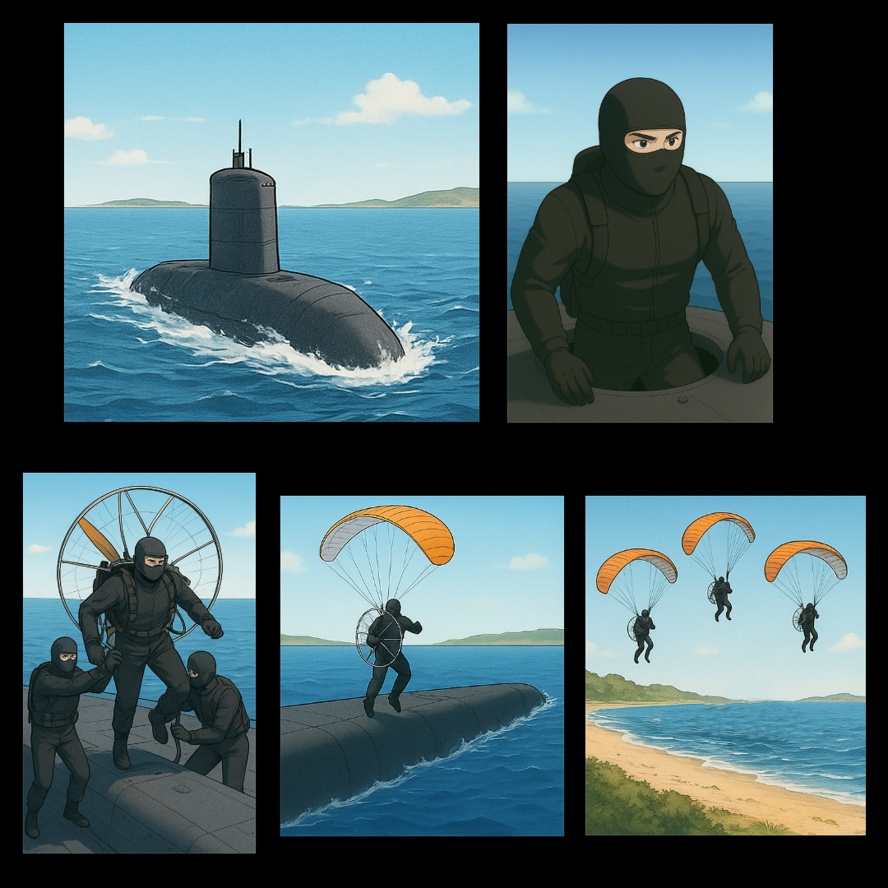

## Prompts For an AI to Generate a Comic Strip

1. Draw a comic book in anime style, with the following story: At early morning, a submarine approaches the surface from beneath the sea. The sea is calm and small waves crash onto the submarine's hull. As the submarine surfaces, some land is visible far away at the horizon, behind the submarine. Upon floating onto the surface of the water, a hatch opens on the submarine's deck, and a commando dressed in black, steps out, onto the deck. The commando then hauls paramotor equipment from the hatch, onto the submarine's deck. Two more persons dressed in black, climb out of the hatch and help the commando wear the paramotor backpack as they stand on the deck. The equipped commando faces the length of the submarine and walks few paces away from the hatch towards the bow of the vessel. With the battery driven propeller spinning on the commando's backpack, the commando lets the parachute furl open and swiftly takes a short run towards the edge of the submarine, and then leaps towards the sea, in the direction of the land. The parachute takes the commando higher up into the air, with the paramotor helping the commando glide towards the land. As the commando approach the seashore, three more commandos take to the air from the submarine's deck, each equipped with their paramotor and a glider parachute. The submarine's hatch closes, and it disappears into the sea, underwater. All of the commandos land onto the beach, and quickly remove their glider and paramotor equipment. They group together at the beach, and then run towards the forest further inland, and hide behind thick bushes next to the treeline.    

</img>

2. Draw a comic book in photo realistic style, with the following story: In the darkness of the sea, at night, a submarine floats towards the surface and remains submerged, just below the surface of the water. A hatch opens at the side of the submarine's hull and two people with scuba diving equipment in black swimsuits emerge from the hatch. Each diver holding onto a motorized, underwater scooter, swims away from the submarine while staying submerged. Two more divers come out of the submarine's open hatch, and each of them follow behind the first two divers, each using their personal underwater scooter and scuba equipment. The submarine's hatch closes and it dives deeper, escaping into deep-sea cover. The four scuba-divers swim closer to the surface of the water, close to a beach, under a cloudy night sky. They then jettison their underwater scooters, and smoothly swim to the surface. Without splashing any water, they step onto the beach and walk inland. The four individuals remove their scuba equipment as well as their swimming gear, and leave it on the sandy beach. Still dressed in black commando outfit, they run further inland towards the forest and hide behind thick bushes next to the treeline.   

	</img>

 

### IRL

Now, in real life, practically all submarines are already capable of supporting missions based on "Prompt Num. 1." However, the likelihood is slim, that a person could stand 30 miles from the shore on a submarine's deck, to launch off towards land with a paramotor and not get blown away instead, out into the ocean. It would be one hell of a feat though, if somebody could achieve flying from a sea vessel onto land using a paramotor.[^1] Having said that, amphibious vesicles that can perform a beach landing, could then launch commandos much further inland, via paramotor gliders. 

And as for "Prompt Num. 2", the multitude of submarines that are capable of supporting that type of a mission can do so, at any hour of the day, under most weather conditions when the waters are not too choppy for a beach landing, for such ingress missions. 

Also, the fact that Pakistani Navy's deep-sea divers have been practicing drills as commercial divers working for oil-and-gas companies, or that Pakistani commandos are playing around with paragliding and paramotor equipment, shouldn't come as a surprise.    

[^1]: Similar to this: [Flying Paramotor from Frying Pan Tower across 32.5 Miles of Ocean! Making History!](https://www.youtube.com/watch?v=fOZw5Tm8zEQ&t=552s)